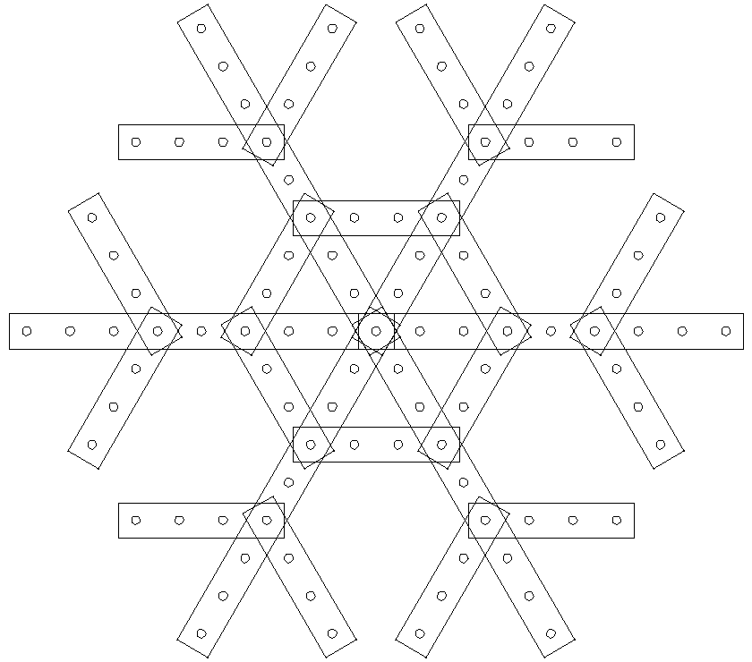
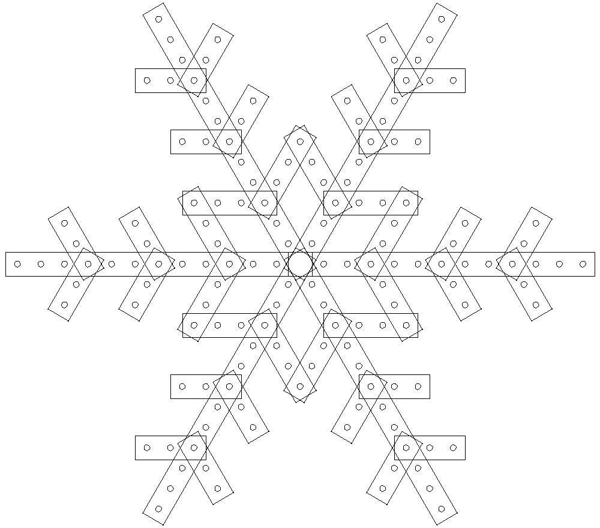

# Light Components

Files and directions to generate the various light components (snowflakes, trees, etc.) used in the light display. Typically designed using LibreCAD.

## Snowflake1

Designed to work with waterproof "bullet" LED lights (not an LED strip). I should upload an wiring diagram -- the two to three inch wire between LED's forces a very particular wiring order.

## Snowflake3

Designed to work with waterproof "bullet" LED lights (not an LED strip). I should upload an wiring diagram -- the two to three inch wire between LED's forces a very particular wiring order.

